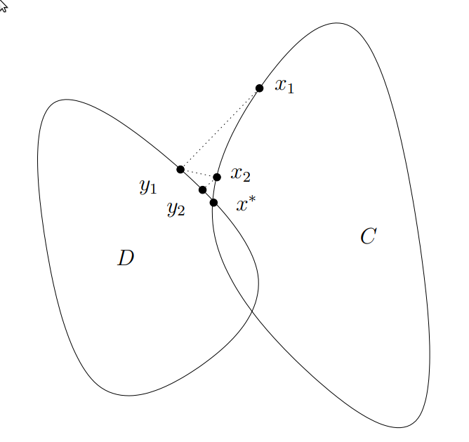
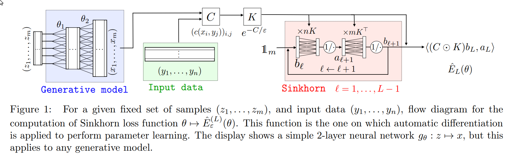

# Recap

## Generative Modeling with Optimal Transport

This is the OT (Optimal Transport) Problem:

\begin{align*}
  d_c(p,q) &= \min_{\pi \in \Pi(p,q)} \inn{C}{\pi}\\
  &= \min_{\pi \in \Pi} \sum_{x,y} c(x,y) \pi(x,y)\\
  & \text{where } c(x,y) = \|x-y\|_2
\end{align*}

First Key Idea: **Do entropy regularization**

\begin{tcolorbox}[]
  \underline{Entropy Regularized OT}

  $$
  d_c^\lamb (p,q) = \min_\pi \inn{C}{\pi} - \lamb H(\pi)
  $$ 
\end{tcolorbox}

Recall that:

1. $- H$ is strongly convex
2. Given $-H$ is strongly convex, implies $d_c^\lamb$ is strongly convex
3. Strongly convex also guarantees unique minimizer
4. $\pi(p,q)$ is a compact set

Second Key Idea: **Bring in KL divergence (or formulate OT in that way)**

Consider $k(x,y) = e^{-c(x,y)/\lamb}$ and normalized values $z_\lamb = \sum_x k(x,y)$.

Then we can create a new (artificial) distribution (Gibbs distribution) with probability $p_k^\lamb =\frac{k(x,y)}{z_\lamb}$.

Then we get,

$$
D(\pi\| p_k^\lamb) = \frac{1}{\lamb}\ \inn{C}{\pi} - H(\pi) + \log z_\lamb
$$ 

\begin{remark}
  $z_\lamb$ has no dependence on $\pi$ (only depends on the cost function $c$). Thus, minimizing the KL divergence is same as minimizing the entropy regularized OT.
\end{remark}

$$
\therefore \ D(\pi\| p_k^\lamb) = \frac{1}{\lamb}\bp{ \inn{C}{\pi} - \lamb H(\pi) } + \log z_\lamb
$$

Third Key Idea (Algorithmic): **Interpret as finding intersection of two convex sets** (Alternating Projection idea)

$$
\pi(p,q) = \pi(p)\cap \pi(q)
$$ 

{width=40%}

The solutions are found as follows:

\begin{align*}
\pi_\lamb^{(2l)} &= \diag \bp{\frac{p}{\pi_\lamb^{2l + 1} 1_m}} \pi^{2l - 1}_\lamb\\
\pi_\lamb^{2l+1} &= \diag \bp{\frac{q}{1_n^T \pi_\lamb^{(2l)}}} \pi^{2l }_\lamb\\
\end{align*}

# Sinkhorn Algorithm

- Previous algorithm iterated on $\pi_\lamb^{(l)}$.
- We iterate more efficiently here.

\begin{prop}  
Let $k\in R^{n\times m}$ with $k_{x,y} = k(x,y)$ 

For some $u\in R^n, \ v \in R^m$,
$$
\pi_{\lamb} = \diag (u)\ k\ \diag (v)
$$ 
\end{prop}

\begin{proof}
\begin{align*}  
L(\pi, f,g) &= \inn{C}{\pi} - \lamb H(\pi) + \inn{f}{p - \pi 1_m} + \inn{g}{q - \pi^T 1_n}\\
\therefore \ \left. \frac{\partial L}{\partial \pi} \right|_{(x,y)} &= \frac{\lamb}{2} + C(x,y) + \frac{\lamb \log \pi(x,y)}{2} - f_x - g_x = 0\\  
\text{Solving for } \pi(x,y)&\\ 
\implies \lamb \log \pi(x,y) &= f_x + g_y - \frac{1}{2} \lamb - \frac{1}{2} \lamb - C(x,y)\\
\implies \log \pi(x,y) &= \bp{\frac{f_x}{\lamb} - \frac{1}{2}}+ \bp{\frac{g_y}{\lamb} - \frac{1}{2}} - \frac{C(x,y)}{\lamb}\\
\implies \pi(x,y) &= e^{f_x/\lamb - 1/2}\ e^{-C(x,y)/\lamb} \ e^{g_y/\lamb - 1/2}
\end{align*}

This is a subset of \textbf{Matrix Scaling} Problems. Scaling algorithms based on the fact that scaling exists.
\end{proof}

Look at $p \otimes q$,

$$
\begin{bmatrix}
  p_1 \\
  p_2 \\
  \vdots \\
  p_n 
\end{bmatrix}
\otimes 
\begin{bmatrix}
  q_1 \\
  q_2 \\
  \vdots \\
  q_n 
\end{bmatrix}
=
\begin{bmatrix}
  p_1 q_1 & p_1 q_2 & \cdots & p_1 q_n\\
  p_2 q_1 & p_2 q_2 & \cdots & p_2 q_n\\
  \vdots &  &  & \vdots\\
  p_n q_1 & p_n q_2 & \cdots & p_n q_n
\end{bmatrix}
$$ 

For matrix, $p \otimes q$, $i^{th}$ row sum is $p_i$ and $i^{th}$ column sum is $q_i$.

\underline{Matrix Scaling}: In the discrete case, scaling problem is about finding $u$ and $v$ that scales the rows and columns such that it matches the row and column sum of the given distribution $p$ and $q$.

In our case,

\begin{align}
p &= \pi 1_m = \diag(u) k v \nonumber\\
q &= \pi^T 1_n = \diag(v) k^T u  \label{eq:so}
\end{align}

\begin{tcolorbox}
\textbf{Sinkhorn Algorithm}:

Approximate solutions to \eqref{eq:so} by initializing 

$$u^{(1)} \equiv 1_n, \ v^{(1)} \equiv 1_m $$
\begin{equation*}
u^{(l+1)} = \frac{p}{k v^{(l)}}, \ v^{(l + 1)} = \frac{q}{k^T u^{(l)}}
\label{eq:an}
\end{equation*}

\end{tcolorbox}

\underline{Claim}: With these choices of the iterates $u^l$ and $v^l$, we obtain primal iterates

\begin{proof}
To see this, we run the primal iterates $\pi^{(2l)}$ and $\pi^{(2l + 1)}$ with these choices of $u^l$ and $v^l$ in \eqref{eq:an}. Use notation $\tilde{\pi}^{(2l)}$ and $\tilde{\pi}^{(2l + 1)}$.

From previous proposition:

\begin{align}
  \tilde{\pi} &= \diag(u) \ l\ \diag(v)\nonumber \\
  \tilde{\pi}^{(2l)} &= \diag(u^{(l+1)})\ l\ \diag(v^l) \label{eq:A}\\
  \tilde{\pi}^{(2l+1)} &= \diag(u^{(l+1)}) \ l\ \diag(v^{l+1}) \label{eq:B}
\end{align}

Rearranging terms from \eqref{eq:B} $(l = l-1)$,

\begin{equation}
k \ \diag (v^l) = \frac{\tilde{\pi}^{(2l - 1)}}{\diag (u^l)} 
\label{eq:C}
\end{equation}

from \eqref{eq:A} we have,
$$
\tilde{\pi}^{(2l)} = \diag (u^{(l + 1)}) \ k \ \diag (v^{l})
$$ 

From \eqref{eq:C},

\begin{align}
\tilde{\pi}^{(2l)} &= \diag (u^{(l + 1)}) \frac{\tilde{\pi}^{(2l - 1)}}{\diag (u^l)} \label{eq:ss}\\
&= \diag \bp{\frac{p}{kv^{(l)}}} \frac{\tilde{\pi}^{(2l - 1)}}{\diag (u^l)} \nonumber\\ 
&= \diag \bp{\frac{p}{\diag (u^{(l)} \ k \ v^{(l)}}} \tilde{\pi}^{(2l - 1)} \nonumber\\ 
&= \diag \bp{\frac{p}{ \tilde{\pi}^{(2l - 1)} 1_m }} \tilde{\pi}^{(2l - 1)} \nonumber
\end{align}

Similarly (for odd iterate),

$$
\diag(u^{(l + 1)}) k = \frac{\tilde{\pi}^{(2l)}}{\diag{(v^l)}}
$$ 

Check for $\tilde{\pi}^{(2l + 1)}$ (as an exercise).

\end{proof}

# Generative Modeling (using Sinkhorn Algo)

\underline{Paper}: [Learning generative modeling with Sinkhorn Divergence, AISTATS, 2018](https://arxiv.org/pdf/1706.00292.pdf)

\begin{algorithm}
\begin{enumerate}
  \item Draw minibatch $x_1, x_2, \ldots, x_B \sim p$ and $y_1, y_2, \ldots, y_B \sim p_\theta$
  \item Approximate $W_1(p, p_\theta) \approx W_1(\hat{p}, \hat{p}_\theta)$ 
  $$
  \hat{p}(x) = \frac{1}{B} \sum_{i=1}^B 1 \ x_i = x, \quad \hat{p}_\theta(x) = \sum_{i=1}^B 1\ y_i = y
  $$ 
  \item Estimate $W_1(\hat{p}, \hat{p}_\theta)$ using Sinkhorn Algorithm.
  \item Compute gradient update
  $$
  \theta = \theta - \eta \nabla_\theta W_1 (\hat{p}, \hat{p}_\theta)
  $$ 
\end{enumerate}

\caption{Sinkhorn divergence generative modeling}
\end{algorithm}

The authors took $c(x,y)$ as $f_\phi(x) - f_\phi(y)$ instead of $\|x-y\|_2$.
